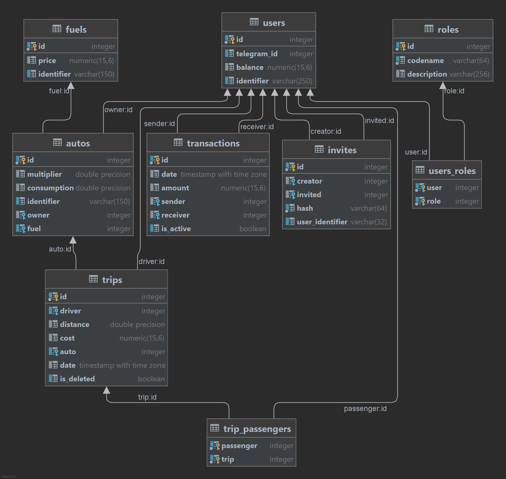

# Bot for controlling trips

## Install  
```
clone this repo
pip install requirements.txt
```
## Usage  
Create a .env file like .env.example file.  
Run migrations:
```
alembic upgrade head
```

Start bot:
```
python -m bot
```

## Docker  
Create .env, .env.postgres, .env.redis files like examples files.  
```
docker-compose up
```

## Database structure  
